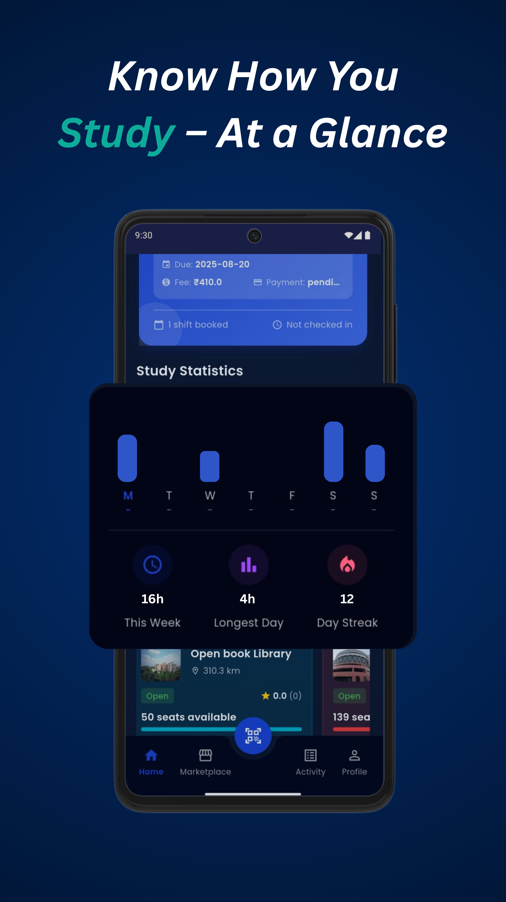
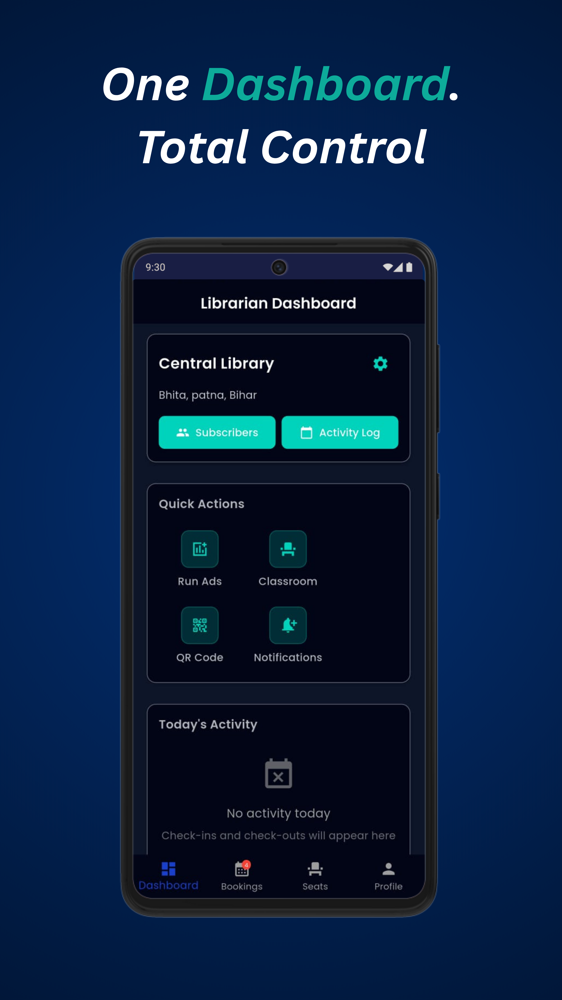
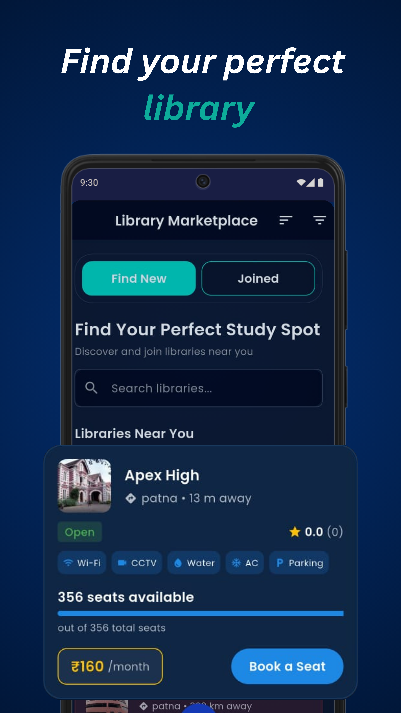
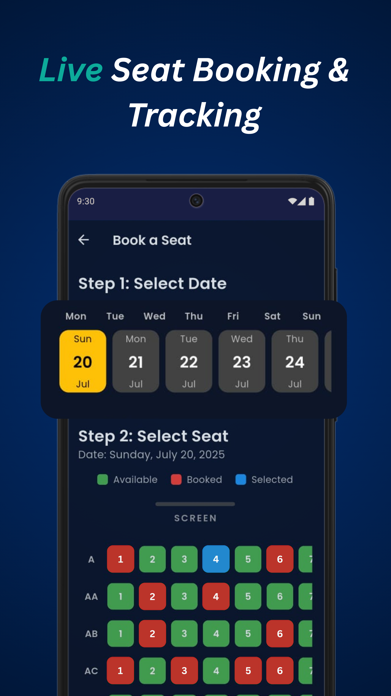
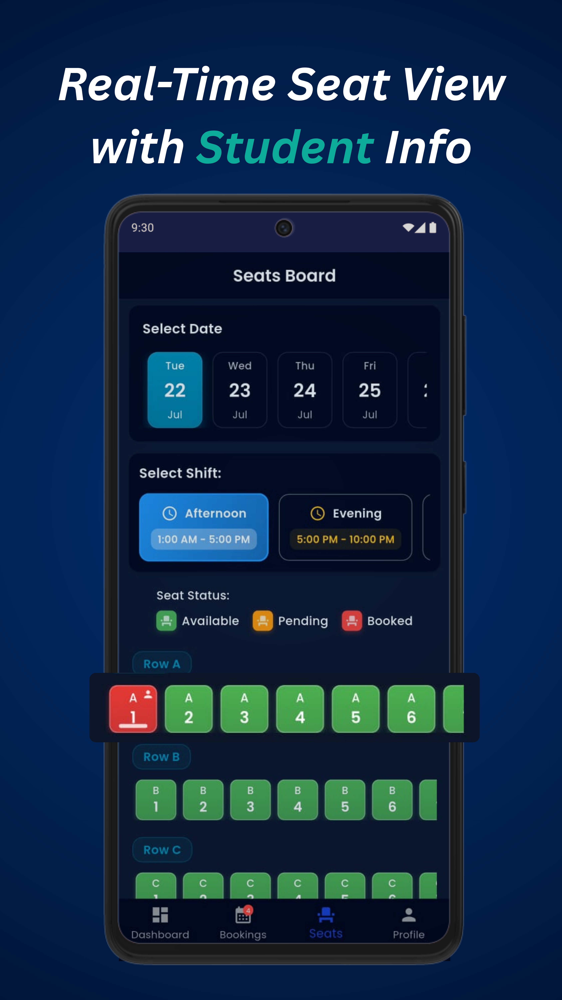
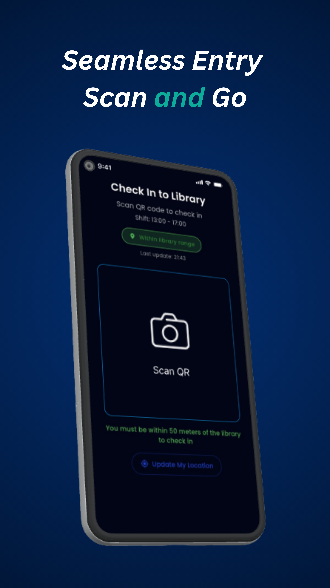
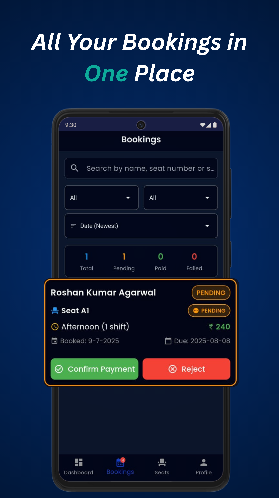

<div align="center">

<br>


<br>

<p align="center">
  
  
  
  
  
</p>

<p align="center">
  
  
  
  
</p>

<br>

<h3>
  <em>"Every seat reserved. Every session tracked. Every reader empowered."</em>
</h3>

<br>

[](https://github.com/vivekrt/smartlib)
[](https://github.com/vivekrt/smartlib/releases)
[](https://github.com/vivekrt/smartlib/issues)
[](https://github.com/vivekrt/smartlib/issues)

<br>

---

</div>

## 📑 Table of Contents

- [🌟 About SmartLib](#-about-smartlib)
- [✨ Features](#-features)
- [📸 Screenshots](#-screenshots)
- [🛠️ Tech Stack](#%EF%B8%8F-tech-stack)
- [🚀 Getting Started](#-getting-started)
- [📁 Project Structure](#-project-structure)
- [🗺 Roadmap](#-roadmap)
- [🎯 Use Cases](#-use-cases)
- [🔐 Privacy Policy](#-privacy-policy)
- [🤝 Contributing](#-contributing)
- [📄 License](#-license)
- [👨‍💻 Author](#-author)

<br>

---

## 🌟 About SmartLib

<table>
<tr>
<td>

**SmartLib** is a full-stack Flutter application that bridges the gap between **libraries and their members**. It is not just a book finder — it is a complete **study space management ecosystem**.

Whether you are a student looking for the perfect study spot, a library admin managing hundreds of seats, or an institution trying to digitize its operations — **SmartLib has you covered**.

> 🎯 Built from the ground up for the Indian study culture — affordable, fast, and deeply practical.

</td>
</tr>
</table>

<br>

### 💡 The Problem We Solve

```
❌  Students waste time visiting libraries only to find no seats available
❌  Libraries struggle with manual, error-prone seat and booking management
❌  No unified platform connects readers to nearby study spaces
❌  Study habits go untracked — no motivation, no consistency

✅  SmartLib solves all of this in one app
```

<br>

---

## ✨ Features

<br>

<table>
<tr>
<td width="33%" align="center">

### 🏛️
**Library Marketplace**

Browse libraries near you with distance, ratings, amenity filters (Wi‑Fi · AC · CCTV · Parking · Water), live seat counts, and pricing. One tap to book.

</td>
<td width="33%" align="center">

### 🪑
**Live Seat Booking**

Real-time color-coded seat grid. Pick your date, pick your shift, pick your seat. 🟢 Available · 🔴 Booked · 🔵 Selected.

</td>
<td width="33%" align="center">

### 🛂
**QR Check-In**

Location-aware GPS check-in. Students scan the library QR code to mark attendance — only valid within **50 metres** of the library.

</td>
</tr>
<tr>
<td width="33%" align="center">

### 📊
**Study Statistics**

Weekly bar chart, total study hours, longest day record, and daily streak tracker 🔥 — gamified to keep you consistent.

</td>
<td width="33%" align="center">

### 📋
**Booking History**

Search, filter, and sort all bookings. Admins can **Confirm Payment** ✅ or **Reject** ❌ directly from each booking card.

</td>
<td width="33%" align="center">

### 🖥️
**Librarian Dashboard**

Run ads, manage classrooms, send notifications, generate QR codes, view subscribers and activity logs — from one screen.

</td>
</tr>
<tr>
<td width="33%" align="center">

### 🗓️
**Seats Board (Admin)**

Real-time admin seat map filtered by date and shift. Instant visual of 🟢 Available · 🟡 Pending · 🔴 Booked across all rows.

</td>
<td width="33%" align="center">

### 🔐
**Role-Based Auth**

Separate secure flows for students and librarians. Firebase-backed auth, encrypted storage, and privacy-first data handling.

</td>
<td width="33%" align="center">

### 🔔
**Smart Notifications**

Booking confirmations, due date reminders, and admin broadcast alerts powered by Firebase Cloud Messaging.

</td>
</tr>
</table>

<br>

---

## 📸 Screenshots

> **Dark-themed. Clean. Built for real users.**
> All screens captured on Android — Flutter renders identically on iOS.

<br>

---

### 📊 Study Statistics — *Know How You Study, At a Glance*

<p align="center">
  
</p>

<details>
<summary><b>📋 Screen Breakdown</b></summary>
<br>

| Element | Detail |
|---------|--------|
| 📅 **Status Bar** | Shows due date `2025-08-20`, fee `₹410`, payment status, shift booked, and check-in status |
| 📈 **Weekly Bar Chart** | Mon–Sun study activity visualized as vertical bars — instantly see your busiest days |
| 🏆 **Stat Cards** | `16h` This Week · `4h` Longest Day · `🔥 12` Day Streak — gamified progress tracking |
| 🏛️ **Nearby Library Card** | *Open Book Library* · 310.3 km · ⭐ 0.0 · 50 seats available with live status |
| 🧭 **Bottom Nav** | Home · Marketplace · Activity · Profile |

</details>

<br>

---

### 🖥️ Librarian Dashboard — *One Dashboard. Total Control.*

<p align="center">
  
</p>

<details>
<summary><b>📋 Screen Breakdown</b></summary>
<br>

| Element | Detail |
|---------|--------|
| 🏛️ **Library Header** | **Central Library**, Bhita, Patna, Bihar — with a settings gear for quick config access |
| 🔵 **Access Pills** | One-tap access to **Subscribers** list and **Activity Log** |
| ⚡ **Quick Actions Grid** | 2×2 grid — Run Ads · Classroom · QR Code · Notifications |
| 📅 **Today's Activity** | Live check-in / check-out feed — empty state shown when no activity yet |
| 🧭 **Bottom Nav** | Dashboard (active) · Bookings · Seats · Profile |

</details>

<br>

---

### 🏛️ Library Marketplace — *Find Your Perfect Library*

<p align="center">
  
</p>

<details>
<summary><b>📋 Screen Breakdown</b></summary>
<br>

| Element | Detail |
|---------|--------|
| 🔀 **Toggle Tabs** | **Find New** (active, teal highlight) · **Joined** — switch between discovery and enrolled libraries |
| 🔍 **Search Bar** | Instant search across all nearby libraries |
| 📍 **Library Card** | **Apex High**, Patna · `13 m away` · `Open` badge · ⭐ 0.0 rating |
| 🏷️ **Amenity Chips** | Wi-Fi · CCTV · Water · AC · Parking — at-a-glance facility overview |
| 💺 **Live Availability** | `356 seats available out of 356 total` with a visual progress bar |
| 💰 **Pricing + CTA** | `₹160/month` with a prominent teal **Book a Seat** action button |

</details>

<br>

---

### 🪑 Seat Booking — *Live Seat Booking & Tracking*

<p align="center">
  
</p>

<details>
<summary><b>📋 Screen Breakdown</b></summary>
<br>

| Element | Detail |
|---------|--------|
| 📅 **Step 1 — Select Date** | Horizontal scrollable weekly calendar; selected date (`Sun 20 Jul`) highlighted in bold yellow |
| 🗺️ **Step 2 — Select Seat** | Real-time seat grid with `SCREEN` label at top for spatial orientation |
| 🟢 **Available** | Green tiles — tap to select your preferred seat |
| 🔴 **Booked** | Red tiles — already reserved by another student |
| 🔵 **Selected** | Blue tile — your current selection before confirming |
| 📐 **Rows** | Labelled rows A, AA, AB, AC… — easy to navigate for large halls |

</details>

<br>

---

### 🗺️ Seats Board — *Real-Time Seat View with Student Info*

<p align="center">
  
</p>

<details>
<summary><b>📋 Screen Breakdown</b></summary>
<br>

| Element | Detail |
|---------|--------|
| 📅 **Date Selector** | Scrollable strip — Tue 22, Wed 23, Thu 24, Fri 25 (Jul) for quick date switching |
| 🕐 **Shift Toggle** | `🌤 Afternoon (1:00 AM–5:00 PM)` active · `🌙 Evening (5:00 PM–10:00 PM)` — tap to switch |
| 🏷️ **Status Legend** | 🟢 Available · 🟡 Pending · 🔴 Booked — visible at all times for quick reference |
| 🗺️ **Seat Map** | Row A: seat 1 booked (red), seats 2–6 available (green) · Row B · Row C shown below |
| 👤 **Student Info** | Tapping a booked seat reveals the student's booking details |

</details>

<br>

---

### 🛂 QR Check-In — *Seamless Entry. Scan and Go.*

<p align="center">
  
</p>

<details>
<summary><b>📋 Screen Breakdown</b></summary>
<br>

| Element | Detail |
|---------|--------|
| 📌 **Screen Title** | **Check In to Library** — clear, unambiguous purpose |
| ⏰ **Active Shift** | Current shift hours displayed — `13:00 – 17:00` |
| ✅ **Location Badge** | `within library range` — green pill confirms GPS validation passed |
| 📷 **Scan QR Button** | Large centred camera button with glowing animated border for easy tap target |
| ⚠️ **Range Warning** | *"You must be within 50 meters of the library to check in"* |
| 🔄 **Update Location** | One-tap GPS refresh if the location badge shows out-of-range |

</details>

<br>

---

### 📋 Booking History — *All Your Bookings in One Place*

<p align="center">
  
</p>

<details>
<summary><b>📋 Screen Breakdown</b></summary>
<br>

| Element | Detail |
|---------|--------|
| 🔍 **Search Bar** | Search by student name, seat number, or booking status |
| 🔽 **Dual Filters** | Filter by booking type and payment status independently |
| 📅 **Sort Control** | Default: **Date (Newest)** — swappable for oldest or status-based sort |
| 📊 **Summary Counters** | `1 Total · 1 Pending · 0 Paid · 0 Failed` — instant dashboard at the top |
| 🧾 **Booking Card** | Student: **Roshan Kumar Agarwal** · `PENDING` orange badge · Seat A1 · Afternoon shift · `₹240` |
| 📅 **Dates** | Booked: `9-7-2025` · Due: `2025-08-08` — both displayed clearly on card |
| ✅❌ **Admin Actions** | **Confirm Payment** (green) · **Reject** (red) — one-tap admin response from the list |

</details>

<br>

---

## 🛠️ Tech Stack

<br>

<div align="center">

| Layer | Technology | Purpose |
|:------|:----------:|:--------|
| 📱 **Frontend** |  | Cross-platform mobile UI (Android + iOS) |
| ☁️ **Backend** |  | Auth, real-time sync, cloud functions |
| 🗄️ **Database** |  | Cloud NoSQL database for all app data |
| 📍 **Location** |  | GPS-based QR check-in validation |
| 📷 **QR Scanning** |  | Fast, reliable QR code camera reader |
| 🔐 **Auth** |  | Secure role-based login for students & admins |
| 🔔 **Notifications** |  | Push alerts for bookings & reminders |
| 📊 **Charts** |  | Weekly study statistics bar graph |
| 🏗️ **State Mgmt** |  | Reactive app-wide state management |

</div>

<br>

---

## 🚀 Getting Started

### ✅ Prerequisites

Before you begin, make sure you have the following installed:

```
✔  Flutter SDK     >= 3.0.0
✔  Dart            >= 3.0.0
✔  Android Studio  (with Flutter & Dart plugins)
✔  VS Code         (optional, with Flutter extension)
✔  Firebase CLI    (for backend setup)
✔  Git
```

### 📦 Installation

```bash
# Step 1 — Clone the repository
git clone https://github.com/vivekrt/smartlib.git

# Step 2 — Navigate into the project folder
cd smartlib

# Step 3 — Install all Flutter dependencies
flutter pub get

# Step 4 — Configure Firebase
#   → Place google-services.json     in   android/app/
#   → Place GoogleService-Info.plist in   ios/Runner/

# Step 5 — Run the app on a connected device or emulator
flutter run
```

### 🏗️ Build for Production

```bash
# Android — Release APK
flutter build apk --release

# Android — App Bundle (for Google Play Store)
flutter build appbundle --release

# iOS — Archive (for App Store)
flutter build ipa --release
```

<br>

---

## 📁 Project Structure

```
smartlib/
├── 📁 android/                  # Android platform files
├── 📁 ios/                      # iOS platform files
├── 📁 assets/                   # Images, icons, screenshots
│   ├── booking_history_Medium.png
│   ├── daily_study_bar_Medium.png
│   ├── dashboard_Medium.png
│   ├── marketplace_Medium.png
│   ├── scan_qr_Medium.png
│   ├── seat_booking_Medium.png
│   └── seat_view_Medium.png
├── 📁 lib/
│   ├── 📁 core/                 # App-wide utilities, constants, themes
│   ├── 📁 data/                 # Repositories, data sources, models
│   ├── 📁 features/
│   │   ├── 📁 auth/             # Login, register, role selection
│   │   ├── 📁 dashboard/        # Librarian dashboard screen
│   │   ├── 📁 marketplace/      # Library discovery & browsing
│   │   ├── 📁 seat_booking/     # Date + seat selection flow
│   │   ├── 📁 seat_view/        # Admin real-time seats board
│   │   ├── 📁 bookings/         # Booking history & management
│   │   ├── 📁 scan_qr/          # GPS-verified QR check-in
│   │   └── 📁 statistics/       # Study stats & streak tracker
│   └── main.dart                # App entry point
├── pubspec.yaml                 # Dependencies & assets
└── README.md
```

<br>

---

## 🗺 Roadmap

```
Phase 1 — Core (✅ Complete)
────────────────────────────────────────
 ✅  Library Marketplace (discover & join)
 ✅  Real-time seat booking grid
 ✅  QR Code check-in with GPS verification
 ✅  Booking history with admin controls
 ✅  Librarian dashboard
 ✅  Weekly study statistics & streak tracker
 ✅  Role-based auth (student / admin)
 ✅  Multi-library support

Phase 2 — Growth (🔜 Coming Soon)
────────────────────────────────────────
 🔜  Book reservation system
 🔜  AI-based book & library recommendations
 🔜  In-app payments (Razorpay / UPI)
 🔜  Push notifications & booking reminders

Phase 3 — Scale (📅 Planned)
────────────────────────────────────────
 📅  Web version (Flutter Web)
 📅  Multi-language support (Hindi, Bengali)
 📅  Advanced analytics dashboard for admins
 📅  Dark / Light theme toggle for users
 📅  Offline-first mode (SQLite caching)
```

<br>

---

## 🎯 Use Cases

<br>

<table>
<tr>
<td align="center" width="20%">👩‍🎓<br><b>Students</b></td>
<td>Find libraries near you, book seats in advance, scan QR to check in, and track your daily study hours with streaks and stats.</td>
</tr>
<tr>
<td align="center">📚<br><b>Readers</b></td>
<td>Discover books across multiple libraries, check real-time availability, save favorites, and manage your reading list.</td>
</tr>
<tr>
<td align="center">🏛️<br><b>Librarians</b></td>
<td>Manage seats, confirm or reject bookings, send notifications, view subscriber lists, and monitor daily activity — all from the dashboard.</td>
</tr>
<tr>
<td align="center">🏫<br><b>Institutions</b></td>
<td>Digitize library operations end-to-end — from discovery and booking to attendance and payments — at scale.</td>
</tr>
<tr>
<td align="center">🏙️<br><b>Study Spaces</b></td>
<td>List your space on the marketplace, attract members in your area, and manage everything from a single admin interface.</td>
</tr>
</table>

<br>

---

## 🔐 Privacy Policy

SmartLib is committed to **protecting your privacy at every layer** of the application.

<table>
<tr>
<th align="left">Policy</th>
<th align="center">Status</th>
</tr>
<tr>
<td>Collects basic user info (name, email)</td>
<td align="center">✅ Minimal — only what's necessary</td>
</tr>
<tr>
<td>Sells personal data to third parties</td>
<td align="center">❌ Never, under any circumstances</td>
</tr>
<tr>
<td>Encrypted & secure data storage</td>
<td align="center">✅ Always enforced</td>
</tr>
<tr>
<td>Location data (GPS for check-in)</td>
<td align="center">✅ Used only at check-in — never stored or tracked continuously</td>
</tr>
<tr>
<td>Study statistics processing</td>
<td align="center">✅ Fully anonymized and local-first</td>
</tr>
<tr>
<td>Third-party analytics or ad trackers</td>
<td align="center">❌ None embedded in the app</td>
</tr>
</table>

<br>

> 📧 Privacy concerns or data requests? Email: **[devivekrt@gmail.com](mailto:devivekrt@gmail.com)**

<br>

---

## 🤝 Contributing

Contributions are what make open source amazing. Every kind of contribution is welcome — big or small.

```bash
# 1. Fork this repository on GitHub

# 2. Clone your fork locally
git clone https://github.com/YOUR_USERNAME/smartlib.git
cd smartlib

# 3. Create a new feature branch
git checkout -b feature/YourAmazingFeature

# 4. Make your changes and commit with a descriptive message
git commit -m "✨ feat: add YourAmazingFeature"

# 5. Push your branch to your fork
git push origin feature/YourAmazingFeature

# 6. Open a Pull Request on GitHub — we'll review it promptly 🎉
```

### 🧭 Contribution Guidelines

- Follow the existing code style and folder structure
- Write clear, descriptive commit messages
- Add comments for complex logic
- Test on both Android and iOS where possible
- Update the README if you add a new feature or screen

<br>

> 💬 Have an idea but not sure how to implement it? [Open a Discussion](https://github.com/vivekrt/smartlib/discussions) — we love talking about the product!

<br>

---

## 📄 License

```
MIT License

Copyright (c) 2025 Vivek Kumar

Permission is hereby granted, free of charge, to any person obtaining a copy
of this software and associated documentation files (the "Software"), to deal
in the Software without restriction, including without limitation the rights
to use, copy, modify, merge, publish, distribute, sublicense, and/or sell
copies of the Software, and to permit persons to whom the Software is
furnished to do so, subject to the following conditions:

The above copyright notice and this permission notice shall be included in all
copies or substantial portions of the Software.
```

See the full [LICENSE](LICENSE) file for details.

<br>

---

## 👨‍💻 Author

<div align="center">

<br>


<br>

## Vivek Kumar

**Flutter Developer · Bihar, India 🇮🇳**

*Passionate about building tools that make everyday life simpler — one screen at a time.*

<br>

[](https://github.com/vivekrt)
[](mailto:devivekrt@gmail.com)
[](https://linkedin.com/in/vivekrt)

<br>

*Built with ❤️, late nights, and strong chai ☕ from Bihar, India*

</div>

<br>

---

<div align="center">

<br>

```
██████████████████████████████████████████████████████
█                                                    █
█    ⭐  If SmartLib helped or inspired you —        █
█       drop a star on GitHub!                       █
█       It takes 2 seconds and means everything. 🙏  █
█                                                    █
██████████████████████████████████████████████████████
```

<br>

<a href="https://github.com/vivekrt/smartlib">
  
</a>
&nbsp;&nbsp;
<a href="https://github.com/vivekrt/smartlib/fork">
  
</a>
&nbsp;&nbsp;
<a href="https://github.com/vivekrt/smartlib/watchers">
  
</a>

<br><br>

**SmartLib** — *Connecting readers with knowledge, one seat at a time.*

<br>

`© 2025 Vivek Kumar · MIT License · Made in Bihar, India 🇮🇳`

</div>
