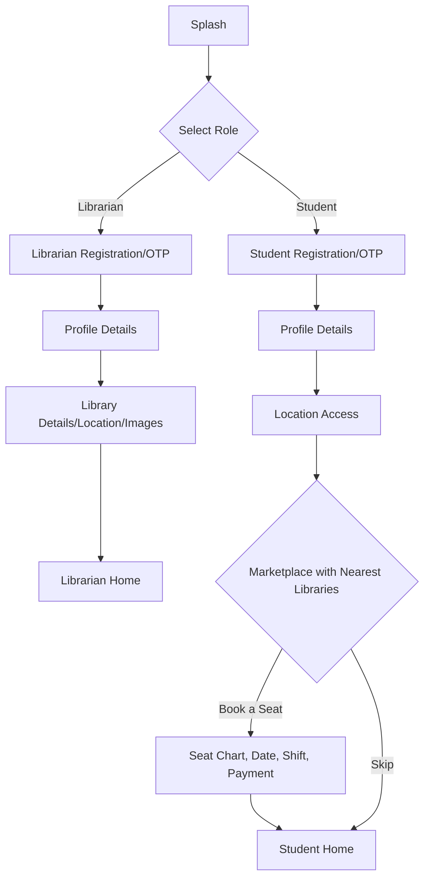

# SmartLib – Comprehensive Data Structure & Application Flow

This document presents a **clear and efficient data architecture** for SmartLib, supporting robust library management, seat booking, and real-time features for both students and librarians. It also details the main flows and addresses key questions for implementation.

---

## **1. Database Structure Overview**

### **A. Firebase Realtime Database**
_Used for real-time user activity, presence, and session-based data._

```
users/
  students/
    {studentId}/
      profile: {name, email, phone, photo, joinedAt}
      currentStatus: 
        { isCheckedIn, currentLibraryId, currentSeatId, checkInTime }
        
      joinedLibraries: 
        { libraryId1: true, ... }
      connectionStatus: 
        { isOnline, lastSeen }
      
  librarians/
    {librarianId}/
      profile: {name, email, phone, photo, joinedAt}
      ownerOfLibraries: libraryId
      staffMembers: 
        { libraryId1: true, libraryId2: true, ... }
        
```

---

### **B. Firestore Database**
_Used for structured, queryable library-centric data._

```
libraries/
  {libraryId}/
    librarianId
    libraryName
    address: {city, state, ...}
    contactInfo: {phone, email}
    locationLatitude
    locationLongitude
    establishedDate
    ownerName
    description
    availableSeats
    totalSeats
    utilities: [wifi, ac, ...]
    rules: [...]
    tags: [...]
    libraryImageUrls: [...]
    shifts: 
      { shiftId: { name, startTime, endTime, fee } }
    seats/
      { seatNo }:
        { 
          shifts:
            { shiftId: 
                { status: available/booked, bookedBy, bookingId, checkIn, checkOut }
            }
        }
    reviews: 
      { reviewId: { studentId, rating, comment, timestamp } }
    studentsCount
    status
    rating
    createdAt
    updatedAt
    
    attendanceHistory: 
          { date: { studentId, seatNo, shiftId, status, checkInTime, checkOutTime, duration } }
    seatBookings/
        { bookingId }:
          { libraryId,studentId, seatNo, shiftId, status, bookedAt, expriyDate,dueDate, paymentStatus }


(firestore)libraries/{libraryId}/
  info: { name, address, etc. }
  shifts: {
    morning: { name: "Morning", startTime: "08:00", endTime: "12:00", fee: 50 },
    afternoon: { name: "Afternoon", startTime: "12:00", endTime: "16:00", fee: 50 },
    evening: { name: "Evening", startTime: "16:00", endTime: "20:00", fee: 75 }
  }
  seats: {
    A1: {
      shifts: {
        morning: { status: "available" },
        afternoon: { status: "booked", bookedBy: "studentId", bookingId: "bookingId" },
        evening: { status: "available" }
      }
    },
    A2: { 
      shifts: {...}
    }
  }

(firestore)seatBookings/{bookingId}: {
  libraryId: "lib123",
  studentId: "student456",
  seatNo: "A1",
  shiftId: "morning",
  date: "2025-06-13",
  status: "confirmed", // confirmed, canceled, expired
  bookedAt: "2025-06-11 08:30:45",
  expiryDate: "2025-06-13",
  paymentStatus: "paid", // paid, pending
  paymentMethod: "online", // online, pay to owner
  paymentId: "payment123",

}

(realtime)/users/students/{studentId}/
  profile: {...}
  seatBookings: {
    bookingId1: true,
    bookingId2: true
  }
  currentStatus: {
    currentLibraryId: "lib123",
    currentSeatNo: "A1",
    shiftStartTime: "07:30:45"
    shiftEndTime: "12:30:45"
    shiftId: "morning"
    dueDate: "2025-06-13",
  }
  
  attendanceHistory:
  isCheckedIn: false,
  streak: 5, // number of consecutive days checked in
  Status: "checkedIn", // checkedIn, checkedOut, noShow
          { date: { studentId, seatNo, shiftId, status//active, completed, checkInTime, checkOutTime, duration } }
  //update seatBookings status to active or expired based on dueDate or expiryDate
  
```


---

### **C. Firebase Storage**
_Used for storing all images (user photos, library images, etc.), referenced via URLs in either database._

---

## **2. Main Application Flow**

### **A. Registration & Onboarding**

#### **Librarian**
1. Splash → Select Librarian
2. Enter email, phone, password → Submit
3. OTP sent → Enter OTP → Verify
4. Enter profile details → Save to `/users/librarians`
5. Enter library details → Save to `/libraries`
6. Set location (lat/lon) and upload images
7. Finish onboarding → Redirect to Librarian Home

#### **Student**
1. Splash → Select Student
2. Enter email, phone, password → Submit
3. OTP sent → Enter OTP → Verify
4. Enter profile details → Save to `/users/students`
5. Request location permission
6. Show marketplace with nearest libraries (using geo-distance), or allow skip
7. Select library → Show details → Book seat or skip
8. If booking:
    - Show seat chart (visualize seats by shift & status)
    - Select date, seat, shift → Confirm
    - Payment page → Done → Save booking to both `/users/students/{studentId}/seatBookings` and `/libraries/{libraryId}/seats`
9. If skip, redirect to student home

---

## **3. Key Design Answers**

### **1. Library Ownership**
- Each library in Firestore has `librarianId`.
- Each librarian in RealtimeDB has `ownedLibraries` for fast lookup.

### **2. Student Memberships**
- Each student in RealtimeDB has `memberships` (joinedLibraries).
- Optionally, `/libraries/{libraryId}/joinedStudents` for reverse lookup.

### **3. Nearest Library Calculation**
- Student’s current GPS (lat/lon) vs. library’s `locationLatitude` & `locationLongitude` (Haversine formula, client-side).
- Sort and display the nearest libraries.

### **4. Network Connection**
- Use `connectivity_plus` or similar package.
- Update `connectionStatus` in RealtimeDB for real-time presence.
- Show offline/online banners in UI.

### **5. Seat Visualization**
- Each `/libraries/{libraryId}/seats/{seatNo}/shifts/{shiftId}` holds booking info and status.
- “Available”, “Occupied”, “Partially Full” (if some shifts taken, others not).
- Booking per seat is per-shift, per-date.

### **6. Seat Control & Check-in/out**
- QR code scan to check in: update student’s `currentStatus`, booking’s `checkIn`, seat’s shift status.
- Scan to check out: update booking’s `checkOut`, duration, and seat/shift status.

### **7. Due Dates & Extras**
- Booking objects include `dueDate` for seat/time expiration.
- Payment status, notifications, activity logs, etc. also tracked.

### **8. Current Shift Student Count**
- For current shift: count seats with `status: booked` in `/seats/{seatNo}/shifts/{shiftId}`.
- Show as number or visual indicator on seat chart.

---

## **4. Additional Important Concepts**

- **Images**: Store only URLs in DB, files in Firebase Storage.
- **Payments**: Store transaction info in booking.
- **Notifications**: Use tokens per user for FCM.
- **Audit Logs**: Optionally, log all actions for admin/troubleshooting.
- **Security**: Use Firestore/RealtimeDB rules to enforce access.
- **Indexes**: Create composite indexes for frequent queries (e.g. by city, rating, etc.).
- **Privacy**: Never expose personal info outside intended scope.

---

## **5. Flowchart Overview**


---

## **6. Summary Table: Key Data Relationships**

| Entity     | Related To              | Relationship Type      | Storage Location            |
|------------|-------------------------|-----------------------|-----------------------------|
| Student    | Library (membership)    | Many-to-many          | Realtime: memberships       |
| Librarian  | Library (ownership)     | One-to-many           | Realtime: ownedLibraries, Firestore: librarianId |
| Library    | Seat                    | One-to-many           | Firestore: seats            |
| Seat       | Shift                   | One-to-many           | Firestore: seats/{seatNo}/shifts |
| Booking    | Student, Library, Seat  | Many-to-one (each)    | Realtime: seatBookings, Firestore: seats |
| Shift      | Booking                 | One-to-one or empty   | Firestore: seats/{seatNo}/shifts |
| Review     | Library, Student        | Many-to-one           | Firestore: reviews          |

---

_This structure ensures scalability, efficiency, and a modern user experience for SmartLib._